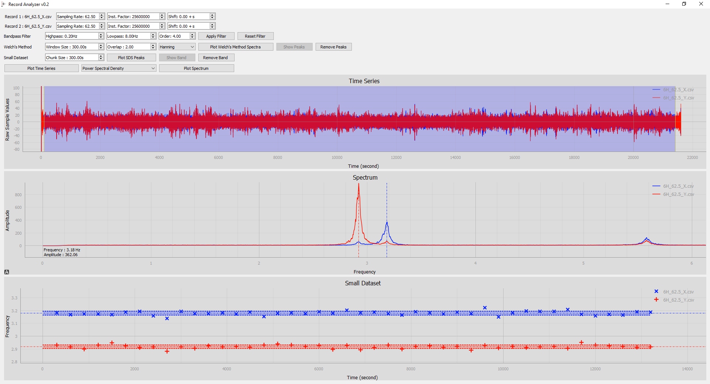
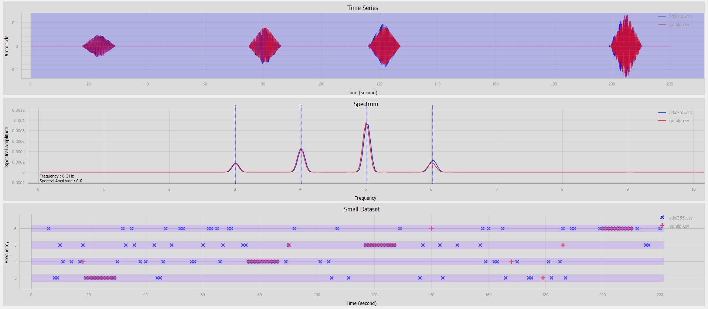

# RecordAnalyzer
Interface for basic spectral analysis.

Compare two record by computing fast fourier transform, power spectral density and Welch's method. 

Track the change in frequency corresponding to maximum amplitude by analyzing small data chunks.

PyQt5, PyQtGraph, ObsPy, Pandas, SciPy, NumPy libraries are needed.

----------------------------------------------------------------------------------

Input file properties
- Only two file can be imported for comparison
- Files need to be placed in records directory.
- Files with .csv, .miniseed, .gcf extension can be imported.
- Files need to contain only one data column.
- If imported MiniSEED file has more than one trace inside the stream, first trace will be imported. 

Record Properties
- Select sampling rate for each record.
- Select instrument factor for the desired unit.
- If records are not syncronized shift time axis to match. 

Bandpass Filter Properties
- Select lowpass, highpass cutoff frequency and order for the filter.
- Apply or reset the filter 

Welch's Method Properties
- Plot spectrum by applying Welch's method.
- Select segment-window size, overlappng amount and windowing type. 

Small Dataset Properties
- Select small dataset size-length as seconds.
- Plot frequency corresponding to highest amplitude in small chunks.

----------------------------------------------------------------------------------

